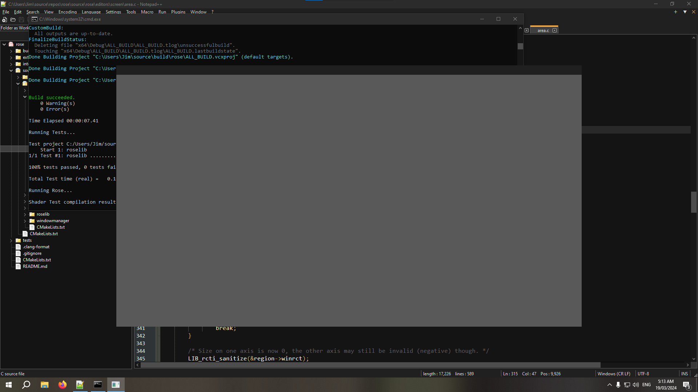

# Rose

Crafting a world anew in its destined form...

Rose is a meticulously crafted library, primarily authored in C and C++, with an unwavering focus on expeditious 3D scene rendering. It provides fully accessible and customizable rendering pipelines, elevating the experience for discerning end users.

"With a steadfast focus, I endeavor to bring forth my cherished vision - a world of resplendence, surpassing even the brightest stars that adorn the night sky."

## Dependencies

Regrettably, due to limitations in time and resources, the library is currently only supported on Windows. However, by overriding the `system` class in the `ghost` library, you can make it run on any system that supports OpenGL.

## How to Build

### Prerequisites

Before proceeding, ensure that the following prerequisites are met:

- **Git:** Make sure Git is installed on your system.
- **CMake:** Ensure CMake is installed and accessible from your command prompt.
- **CLang:** CLang is required to build this!

### Building Rose

1. Clone the Rose repository:

	```bash
	git clone https://github.com/lp64ace/rose.git
	```

2. Navigate to a folder where you want the build files to be generated:

	```bash
	mkdir build & cd build
	cmake ../rose
	```
	
	Note: It is strongly recommended to use Visual Studio, as it is the only platform currently available for testing the library.
	
# Screenshots

A screenshot of the application running with a single editor (VIEW3D) and the default global editor (TOPBAR).


	
# Authors

Dimitris Bokis
[github](http://github.com/lp64ace/)
[website](http://users.auth.gr/dmpokisk/)
